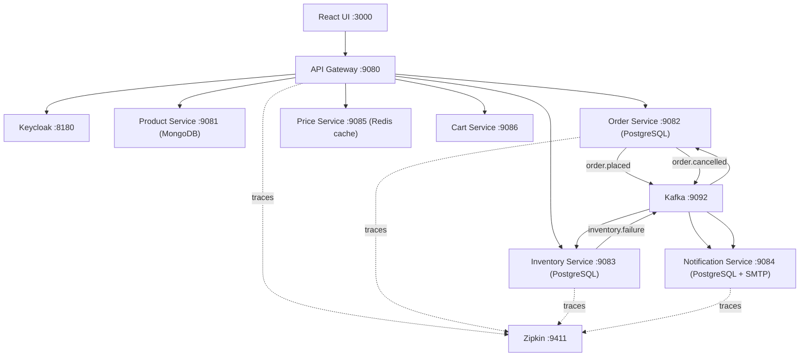

# 1. Project Title + Short Description

## ShopScale Fabric — Event-Driven E-Commerce Microservices

Production-grade microservices marketplace using Java 21, Spring Boot, Kafka, Keycloak, Redis, and Spring Cloud Gateway.
All business APIs are exposed through the API Gateway (`/api/*`) and validated with end-to-end runtime checks.

## 2. 🚀 Key Features

- API Gateway-first architecture with centralized routing, JWT validation, and rate limiting
- Event-driven order lifecycle with Kafka (`order.placed`, `inventory.failure`, `order.cancelled`)
- SAGA-style compensation for inventory failure -> order cancellation flow
- Outbox pattern in order-service for reliable event publishing
- Inbox/idempotency pattern in inventory-service and notification-service
- Circuit breaker + retry + fallback on Cart -> Price integration
- Distributed tracing with Zipkin and trace/span-aware logs
- Full stack runnable with `docker compose up --build -d`

## 3. 🏗️ Architecture Overview

Simple flow:

```text
React UI -> API Gateway -> Product/Order/Price/Cart/Inventory services
                     \
                      -> Keycloak (JWT/OIDC)

Order Service -> Kafka(order.placed) -> Inventory Service
                                      -> Notification Service
Inventory failure -> Kafka(inventory.failure) -> Order Service
Order cancellation -> Kafka(order.cancelled) -> Notification Service
```



## 4. ⚙️ Tech Stack

| Layer | Technology |
|---|---|
| Language | Java 21 |
| Framework | Spring Boot 3.3.x |
| Cloud | Spring Cloud Gateway, Eureka, Config Server |
| Security | Spring Security OAuth2 Resource Server, Keycloak 24 |
| Messaging | Apache Kafka (Confluent `cp-kafka:7.6.1`) |
| Databases | MongoDB 7, PostgreSQL 16 |
| Cache | Redis 7 |
| Resilience | Resilience4j (CircuitBreaker, Retry, TimeLimiter) |
| Observability | Micrometer Tracing + Zipkin |
| Email | MailHog |
| Containerization | Docker + Docker Compose |

## 5. 🔐 Authentication (Keycloak + JWT Flow)

JWT is issued by Keycloak and validated by API Gateway.

Frontend login uses OAuth2 Authorization Code + PKCE (`/login` -> Keycloak redirect -> token exchange).
Resource Owner Password Credentials is disabled for the gateway client.

Gateway validates JWT issuer:

- `http://keycloak:8080/realms/shopscale` (in-container)

## 6. 📦 Microservices Overview

| Service | Host Port | Service Port | Data Store | Responsibility |
|---|---:|---:|---|---|
| api-gateway | 9080 | 8080 | Redis | Auth validation, `/api/*` routing, circuit breaker, rate limiting |
| config-server | 8888 | 8888 | File-backed config repo | Centralized config |
| discovery-service | 8761 | 8761 | — | Service registry |
| product-service | 9081 | 8081 | MongoDB (`productdb`) | Product APIs (`/api/products`) |
| order-service | 9082 | 8082 | PostgreSQL (`orderdb`) | Order APIs, outbox publisher, compensation consumer |
| inventory-service | 9083 | 8083 | PostgreSQL (`inventorydb`) | Inventory APIs, `order.placed` consumer |
| notification-service | 9084 | 8084 | PostgreSQL (`notificationdb`) | Notification consumers + email |
| price-service | 9085 | 8085 | Redis cache | Price APIs |
| cart-service | 9086 | 8086 | — | Cart aggregation and resilience fallback |

## 7. 🔄 Event-Driven Architecture (CRITICAL)

### Order -> Kafka -> Inventory -> Notification

1. Client calls `POST /api/orders` via gateway
2. order-service stores order + outbox record (`outbox_event`) in same transaction
3. `OutboxPublisher` publishes `order.placed`
4. inventory-service consumes `order.placed`, reserves stock
5. notification-service consumes `order.placed`, sends confirmation email

### SAGA Flow

Happy path:

- Order `PLACED` -> inventory reserve success -> notification sent

Compensation path:

- inventory-service publishes `inventory.failure`
- order-service (`InventoryFailureConsumer`) marks order `CANCELLED` and publishes `order.cancelled`
- notification-service sends cancellation email

### Kafka Topics (implemented)

| Topic | Produced By | Consumed By |
|---|---|---|
| `order.placed` | order-service | inventory-service, notification-service, order-service saga listener |
| `inventory.failure` | inventory-service | order-service |
| `order.cancelled` | order-service | notification-service, order-service saga listener |

### Outbox + Inbox (code-backed)

- Outbox (`order-service`):
  - Entity: `outbox_event`
  - Fields include `payload`, `status`, `retryCount`, `lastError`
  - Publisher marks status from `PENDING` -> `SENT`
- Inbox (`inventory-service`, `notification-service`):
  - Entity: `inbox_event`
  - Tracks event processing state for idempotency (`RECEIVED`/`PROCESSED`)

## 8. ⚡ Resilience & Reliability

### Circuit Breaker (Cart -> Price)

Implemented in `PriceClientService`:

- `@CircuitBreaker(name = "priceService", fallbackMethod = "fallbackPrice")`
- `@Retry(name = "priceService", fallbackMethod = "fallbackPrice")`
- Fallback returns `price=0` and `priceSource=FALLBACK`

Configured resilience values (`config-repo/cart-service.yml`):

- Sliding window: 10
- Failure threshold: 50%
- Open state wait: 10s
- Retry attempts: 3
- Time limiter: 4s

### Gateway Reliability

- Route-level circuit breakers with fallback endpoints for product/order/inventory/cart/price
- Gateway time limiter configured to 6s per route instance

### Rate Limiting

Implemented as global gateway filter backed by Redis:

- Keyed by minute bucket + client IP
- Limit: 100 requests/minute for `/api/*`
- Exceeding limit returns `429 Too Many Requests`

## 9. 🔍 Observability

- Zipkin enabled (`http://localhost:9411`)
- Tracing sampling set to `1.0`
- Log formats include trace and span IDs in gateway and services
- Event-flow traces/logs validated with runtime evidence

## 10. 🐳 Docker Setup

One-command startup:

Required environment variables:

```bash
export POSTGRES_PASSWORD='change-me'
export KEYCLOAK_ADMIN_PASSWORD='change-me'
```

```bash
docker compose up --build -d
```

Startup order is enforced with health checks and `depends_on` conditions:

1. Infra: zookeeper, kafka, mongodb, postgres, redis, zipkin, keycloak, mailhog
2. Platform: config-server, discovery-service
3. Business services: gateway, product, order, inventory, notification, price, cart
4. Frontend

Health verification:

```bash
docker compose ps
docker ps --format 'table {{.Names}}\t{{.Status}}'
```

## 11. 🌐 Access URLs

| Component | URL |
|---|---|
| Frontend | `http://localhost:3000` |
| API Gateway | `http://localhost:9080` |
| Keycloak | `http://localhost:8180` |
| Eureka | `http://localhost:8761` |
| Config Server | `http://localhost:8888` |
| Zipkin | `http://localhost:9411` |
| MailHog | `http://localhost:8025` |
| Product Swagger | `http://localhost:9081/swagger-ui.html` |
| Order Swagger | `http://localhost:9082/swagger-ui.html` |
| Price Swagger | `http://localhost:9085/swagger-ui.html` |
| Cart Swagger | `http://localhost:9086/swagger-ui.html` |

## 12. 📡 API Examples (Gateway Endpoints Only)

All API calls below are gateway-only (`http://localhost:9080/api/*`).

```bash
# Products
curl -i http://localhost:9080/api/products
curl -i -X POST http://localhost:9080/api/products \
  -H "Authorization: Bearer $TOKEN" \
  -H "Content-Type: application/json" \
  -d '{"sku":"P100","name":"Product 100","price":199.99,"stock":20,"active":true}'

# Prices
curl -i http://localhost:9080/api/prices -H "Authorization: Bearer $TOKEN"

# Cart
curl -i "http://localhost:9080/api/cart?userId=u1&sku=P1" -H "Authorization: Bearer $TOKEN"
curl -i -X POST http://localhost:9080/api/cart \
  -H "Authorization: Bearer $TOKEN" \
  -H "Content-Type: application/json" \
  -d '{"userId":"u1","sku":"P1"}'

# Orders
curl -i -X POST http://localhost:9080/api/orders \
  -H "Authorization: Bearer $TOKEN" \
  -H "Content-Type: application/json" \
  -d '{"userId":"u1","currency":"USD","totalAmount":199.99,"items":[{"sku":"P1","quantity":1,"unitPrice":199.99}]}'

# Inventory
curl -i http://localhost:9080/api/inventory -H "Authorization: Bearer $TOKEN"
curl -i http://localhost:9080/api/inventory/P1 -H "Authorization: Bearer $TOKEN"
```

## 13. 🧪 Validation / Testing

### Curl validation (gateway-only)

Verified statuses from runtime validation:

| Endpoint | Method | Status |
|---|---|---:|
| `/api/products` | GET | 200 |
| `/api/products` | POST | 200 |
| `/api/prices` | GET | 200 |
| `/api/cart` | GET | 200 |
| `/api/cart` | POST | 200 |
| `/api/orders` | POST | 201 |
| `/api/inventory` | GET | 200 |

### Event flow verification

Verified with runtime logs and DB state:

- Order persisted and outbox published (`Outbox event published successfully`)
- Inventory consumer processed order (`Inventory reserved successfully`)
- Notification consumer sent email (`Email sent successfully`)

### Resilience verification

With `price-service` stopped:

```bash
docker stop shopscale-fabric-price-service-1
curl -i "http://localhost:9080/api/cart/u-resilience/total?sku=P1" -H "Authorization: Bearer $TOKEN"
docker start shopscale-fabric-price-service-1
```

Observed:

- `200 OK`
- Response includes `"priceSource":"FALLBACK"`

## 14. 📊 Non-Functional Requirements

| Requirement | Implementation Evidence |
|---|---|
| Scalability | Stateless services, Dockerized deployment, Java 21 virtual threads enabled |
| Availability | Gateway circuit breakers + fallback endpoints, service health checks, restart policies |
| Consistency | Eventual consistency with Kafka + SAGA compensation |
| Reliability | Outbox publish retry tracking, inbox idempotency tracking |
| Security | JWT validation at gateway, Keycloak OIDC, role-aware security config |
| Performance | Redis cache in price-service, Redis-backed gateway rate limiter |
| Observability | Zipkin tracing + trace/span log correlation |

## 15. 🎥 Demo Flow (Evaluator Script)

1. Start stack:
   - `docker compose up --build -d`
2. Show healthy services:
   - `docker compose ps`
3. Generate token via gateway `/auth/.../token`
4. Run gateway API checks:
   - products, prices, cart, orders, inventory
5. Place an order and show:
   - order `201` response
   - inventory stock decrease for `P1`
   - notification logs showing email sent
6. Resilience test:
   - stop price-service
   - call cart endpoint and show fallback response (`priceSource=FALLBACK`)
7. Rate limit test:
   - burst `/api/products` and show `429` count
8. Trace check:
   - open Zipkin and show recent traces and participating services

## 16. ⚠️ Troubleshooting

| Symptom | Check | Fix |
|---|---|---|
| `401 Unauthorized` | Token missing/expired | Regenerate `TOKEN` via gateway auth endpoint |
| `500` on gateway API | Downstream container unhealthy | `docker compose ps`, restart affected service |
| Order events not progressing | Kafka not running | `docker compose up -d kafka` |
| No emails visible | Notification/mailhog not healthy | Check `notification-service` and `mailhog` logs |
| No traces in Zipkin | Service restart during call window | Re-run call, then refresh `http://localhost:9411` |
