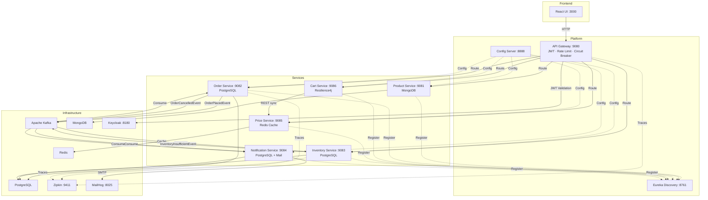

# 🛒 ShopScale Fabric — Event-Driven Microservices Marketplace

> Enterprise-grade microservices platform built with **Java 21**, **Spring Boot 3.3**, **Kafka**, **Eureka**, **Keycloak**, **Redis**, **Resilience4j**, and **Docker**.  
> Designed for high scalability, fault tolerance, and cloud-native deployment using asynchronous communication and resilient architecture.

---

## 📐 Architecture Overview

```
┌──────────────┐       ┌──────────────────────────────────────────────┐
│   React UI   │──────▶│            API Gateway (:9080)               │
│   (:3000)    │       │  JWT Validation · Rate Limiting · Routing    │
└──────────────┘       └──────┬────┬────┬────┬────┬────┬─────────────┘
                              │    │    │    │    │    │
            ┌─────────────────┘    │    │    │    │    └──────────────┐
            ▼                      ▼    │    ▼    ▼                   ▼
   ┌────────────────┐  ┌──────────────┐ │ ┌────────────┐  ┌──────────────┐
   │ Product Service│  │ Order Service│ │ │Cart Service │  │Price Service │
   │   (MongoDB)    │  │ (PostgreSQL) │ │ │(Resilience) │  │  (Redis)     │
   │   :9081        │  │   :9082      │ │ │  :9086      │  │  :9085       │
   └────────────────┘  └──────┬───────┘ │ └──────┬──────┘  └──────────────┘
                              │         │        │
                    Kafka ────┤         │   REST (sync)
                  (Async)     │         │
            ┌─────────────────┘         │
            ▼                           ▼
   ┌──────────────────┐      ┌───────────────────┐
   │Inventory Service │      │Notification Service│
   │  (PostgreSQL)    │      │  (PostgreSQL+Mail) │
   │    :9083         │      │     :9084          │
   └──────────────────┘      └───────────────────┘
```

### Mermaid Diagram (Renders on GitHub)



---

## 🛠️ Tech Stack

| Layer | Technology |
|-------|-----------|
| **Language** | Java 21 (Virtual Threads) |
| **Framework** | Spring Boot 3.3.5, Spring Cloud 2023.0.3 |
| **API Gateway** | Spring Cloud Gateway (Reactive) |
| **Service Discovery** | Netflix Eureka |
| **Centralized Config** | Spring Cloud Config Server (native) |
| **Security** | Keycloak 24 (OAuth2/JWT), Spring Security |
| **Messaging** | Apache Kafka (Confluent 7.6.1) |
| **Databases** | MongoDB 7 (Product), PostgreSQL 16 (Order/Inventory/Notification) |
| **Caching** | Redis 7 |
| **Resilience** | Resilience4j (Circuit Breaker, Retry, TimeLimiter) |
| **Observability** | Zipkin 3, Micrometer, Prometheus metrics |
| **Email** | MailHog (SMTP testing) |
| **Frontend** | React 18, Zustand, Axios |
| **Containerization** | Docker, Docker Compose |
| **Documentation** | SpringDoc OpenAPI 2.6 (Swagger UI) |

---

## 🚀 Quick Start

### Prerequisites

- **Docker** ≥ 24.0 & **Docker Compose** ≥ 2.20
- **8 GB RAM** minimum (recommended 12 GB for all services)
- Ports available: `3000`, `8180`, `8761`, `8888`, `9080-9086`, `9411`

### One-Command Startup

```bash
# Clone the repository
git clone https://github.com/mkarthik2006/shopscale-fabric-microservices.git
cd shopscale-fabric-microservices

# Start the entire platform
docker-compose up --build -d

# Monitor startup progress
docker-compose logs -f
```

### Startup Order (Automatic via healthchecks)

```
1. Zookeeper → Kafka → MongoDB → PostgreSQL → Redis → Keycloak → MailHog → Zipkin
2. Config Server → Discovery Service
3. API Gateway → Product → Order → Inventory → Notification → Price → Cart
4. Frontend
```

> ⏱️ **First boot takes ~3-5 minutes** (Maven builds + image pulls). Subsequent starts are much faster due to Docker layer caching.

### Verify All Services Are Running

```bash
# Check all containers
docker-compose ps

# Check Eureka dashboard — all services should be registered
open http://localhost:8761
```

---

## 🌐 Access Points

| Service | URL | Notes |
|---------|-----|-------|
| **React Frontend** | http://localhost:3000 | Main UI |
| **API Gateway** | http://localhost:9080 | All API traffic enters here |
| **Eureka Dashboard** | http://localhost:8761 | Service registry |
| **Config Server** | http://localhost:8888 | Centralized config |
| **Keycloak Admin** | http://localhost:8180 | Identity provider |
| **Zipkin Traces** | http://localhost:9411 | Distributed tracing |
| **MailHog UI** | http://localhost:8025 | Email testing |
| **Swagger — Product** | http://localhost:9081/swagger-ui.html | Product API docs |
| **Swagger — Order** | http://localhost:9082/swagger-ui.html | Order API docs |
| **Swagger — Price** | http://localhost:9085/swagger-ui.html | Price API docs |
| **Swagger — Cart** | http://localhost:9086/swagger-ui.html | Cart API docs |

---

## 🔐 Authentication (Keycloak)

### Default Users

| Username | Password | Roles |
|----------|----------|-------|
| `testuser` | `password` | `ROLE_USER` |
| `admin` | `admin` | `ROLE_USER`, `ROLE_ADMIN` |

### Get JWT Token

```bash
# Login via Keycloak (Direct Access Grant)
curl -s -X POST http://localhost:8180/realms/shopscale/protocol/openid-connect/token \
  -H "Content-Type: application/x-www-form-urlencoded" \
  -d "grant_type=password" \
  -d "client_id=shopscale-gateway" \
  -d "username=testuser" \
  -d "password=password" | jq -r '.access_token'
```

```bash
# Store token for subsequent requests
export TOKEN=$(curl -s -X POST http://localhost:8180/realms/shopscale/protocol/openid-connect/token \
  -H "Content-Type: application/x-www-form-urlencoded" \
  -d "grant_type=password&client_id=shopscale-gateway&username=testuser&password=password" | jq -r '.access_token')
```

---

## 📦 Microservices

| Service | Port | Database | Communication | Description |
|---------|------|----------|---------------|-------------|
| **api-gateway** | 9080 | Redis (rate limiting) | REST (inbound) | JWT validation, routing, rate limiting, circuit breakers |
| **config-server** | 8888 | — | — | Centralized configuration (native file-based) |
| **discovery-service** | 8761 | — | — | Eureka service registry |
| **product-service** | 9081 | MongoDB | REST | Product catalogue CRUD |
| **order-service** | 9082 | PostgreSQL | REST + Kafka Producer/Consumer | Order management, SAGA orchestration |
| **inventory-service** | 9083 | PostgreSQL | Kafka Consumer/Producer | Stock deduction, SAGA compensation |
| **notification-service** | 9084 | PostgreSQL | Kafka Consumer + SMTP | Email notifications with idempotency |
| **price-service** | 9085 | Redis (cache) | REST | Pricing engine with Redis caching |
| **cart-service** | 9086 | — | REST (→ Price Service) | Cart aggregation with circuit breaker |

---

## 📡 Event-Driven Architecture (SAGA Pattern)

### Happy Path: Order → Inventory → Notification

```
1. User places order via POST /api/orders
2. Order Service saves order (status=PLACED), publishes OrderPlacedEvent to Kafka
3. Inventory Service consumes event, deducts stock
4. Notification Service consumes event, sends confirmation email
```

### Compensation Path: Inventory Failure → Order Cancel → Notification

```
1. Inventory Service detects insufficient stock
2. Publishes InventoryInsufficientEvent to Kafka
3. Order Service consumes event, sets order status=CANCELLED
4. Publishes OrderCancelledEvent to Kafka
5. Notification Service sends cancellation email
```

### Event Structure

```json
{
  "eventId": "550e8400-e29b-41d4-a716-446655440000",
  "eventType": "ORDER_PLACED",
  "occurredAt": "2026-04-06T10:30:00Z",
  "orderId": "123e4567-e89b-12d3-a456-426614174000",
  "userId": "testuser",
  "items": [
    { "sku": "P1", "quantity": 2, "unitPrice": 199.99 }
  ],
  "totalAmount": 399.98,
  "currency": "USD"
}
```

### Kafka Topics

| Topic | Producer | Consumer(s) |
|-------|----------|-------------|
| `order.placed` | Order Service | Inventory Service, Notification Service |
| `inventory.failure` | Inventory Service | Order Service |
| `order.cancelled` | Order Service | Notification Service |

### Reliability Guarantees

- **At-least-once delivery**: Kafka `acks=all`, `enable.idempotence=true`
- **Idempotent consumers**: Database-backed `processed_events` / `processed_notifications` tables
- **Dead Letter Queue**: Failed messages → `.DLT` topics after 3 retries

---

## ⚡ Resiliency

### Circuit Breaker (Cart → Price Service)

```
@CircuitBreaker(name = "priceService", fallbackMethod = "fallbackPrice")
@Retry(name = "priceService")
```

| Parameter | Value |
|-----------|-------|
| Failure rate threshold | 50% |
| Sliding window size | 10 calls |
| Wait duration in open state | 10 seconds |
| Retry max attempts | 3 |
| Retry wait duration | 500ms |
| Timeout | 4 seconds |

### Gateway Circuit Breakers

All 5 gateway routes have dedicated circuit breakers with fallback URIs returning structured 503 responses.

### Rate Limiting

- **Redis-backed** via Spring Cloud Gateway `RequestRateLimiter`
- **100 requests/second** per authenticated user or IP address
- Returns HTTP `429 Too Many Requests` when exceeded

---

## 🧪 Running Tests

```bash
# Run all unit tests
mvn test

# Run tests for a specific service
mvn test -pl cart-service

# Run tests for product-service
mvn test -pl product-service

# Run tests for order-service
mvn test -pl order-service
```

### Test Coverage

| Service | Tests | Coverage |
|---------|-------|----------|
| cart-service | `CartControllerTest`, `PriceClientServiceTest` | Controller + Service + Resilience |
| product-service | `ProductServiceTest` | Full CRUD |
| order-service | `OrderServiceTest`, `InventoryFailureConsumerTest` | Service + SAGA Consumer |
| inventory-service | `OrderPlacedConsumerTest` | Kafka Consumer + Idempotency |
| notification-service | `OrderNotificationConsumerTest` | Email + Idempotency |
| price-service | `PriceServiceTest` | Pricing Logic + Cache |

### Failure Testing (SAGA Validation)

```bash
# 1. Stop Inventory Service
docker-compose stop inventory-service

# 2. Place an order (it will be saved as PLACED)
curl -X POST http://localhost:9080/api/orders \
  -H "Authorization: Bearer $TOKEN" \
  -H "Content-Type: application/json" \
  -d '{"userId":"testuser","items":[{"sku":"P1","quantity":1,"unitPrice":199.99}],"totalAmount":199.99,"currency":"USD"}'

# 3. Restart Inventory Service — Kafka will redeliver the event
docker-compose start inventory-service

# 4. Check order status — should process or trigger SAGA compensation
curl http://localhost:9080/api/orders?userId=testuser \
  -H "Authorization: Bearer $TOKEN"
```

---

## 📑 API Examples

### Products (Public — No Auth Required)

```bash
# List all products
curl http://localhost:9080/api/products

# Create a product
curl -X POST http://localhost:9080/api/products \
  -H "Content-Type: application/json" \
  -d '{"sku":"P1","name":"Enterprise Widget","price":199.99,"stock":100,"active":true}'

# Get product by ID
curl http://localhost:9080/api/products/{id}

# Update product
curl -X PUT http://localhost:9080/api/products/{id} \
  -H "Content-Type: application/json" \
  -d '{"sku":"P1","name":"Updated Widget","price":249.99,"stock":50,"active":true}'

# Delete product
curl -X DELETE http://localhost:9080/api/products/{id}
```

### Orders (Authenticated)

```bash
# Place order (triggers Kafka SAGA)
curl -X POST http://localhost:9080/api/orders \
  -H "Authorization: Bearer $TOKEN" \
  -H "Content-Type: application/json" \
  -d '{
    "userId": "testuser",
    "items": [
      {"sku": "P1", "quantity": 2, "unitPrice": 199.99}
    ],
    "totalAmount": 399.98,
    "currency": "USD"
  }'

# Get orders by user
curl http://localhost:9080/api/orders?userId=testuser \
  -H "Authorization: Bearer $TOKEN"

# Get order by ID
curl http://localhost:9080/api/orders/{orderId} \
  -H "Authorization: Bearer $TOKEN"
```

### Cart (Authenticated)

```bash
# Get cart total for a product
curl "http://localhost:9080/api/v1/cart/testuser/total?sku=P1" \
  -H "Authorization: Bearer $TOKEN"
```

### Prices

```bash
# Get price by SKU
curl http://localhost:9080/api/v1/prices/P1 \
  -H "Authorization: Bearer $TOKEN"
```

### Standard Response Format

All API responses follow a unified envelope:

```json
{
  "status": "SUCCESS",
  "code": 200,
  "message": "Request successful",
  "data": { ... },
  "timestamp": "2026-04-06T10:30:00.000Z"
}
```

---

## 🔍 Observability

### Distributed Tracing (Zipkin)

- **URL**: http://localhost:9411
- **Sampling**: 100% (`probability: 1.0`)
- **Trace flow**: Gateway → Order Service → Kafka → Inventory Service → Notification Service

### Structured Logging

All services use correlated trace/span IDs:

```
INFO [order-service,abc123traceId,xyz789spanId] Placing order for user: testuser
```

### Health & Metrics

```bash
# Health check (any service)
curl http://localhost:9081/actuator/health

# Prometheus metrics
curl http://localhost:9081/actuator/prometheus

# Service info
curl http://localhost:9081/actuator/info
```

---

## 🌍 Environment Variables

All configuration is externalized. No hardcoded values.

| Variable | Default | Used By |
|----------|---------|---------|
| `SERVER_PORT` | Per service | All services |
| `CONFIG_SERVER_HOST` | `localhost` | All services |
| `EUREKA_HOST` | `localhost` | All services |
| `DB_HOST` | `localhost` / `postgres` | Order, Inventory, Notification |
| `DB_NAME` | Service-specific | Order, Inventory, Notification |
| `DB_USER` | `shopscale` | Order, Inventory, Notification |
| `DB_PASS` | `shopscale` | Order, Inventory, Notification |
| `MONGODB_URI` | `mongodb://localhost:27017/productdb` | Product Service |
| `KAFKA_BOOTSTRAP_SERVERS` | `localhost:9092` | Order, Inventory, Notification |
| `REDIS_HOST` | `localhost` | Price Service, API Gateway |
| `REDIS_PORT` | `6379` | Price Service, API Gateway |
| `KEYCLOAK_HOST` | `keycloak` | API Gateway |
| `KEYCLOAK_PORT` | `8080` | API Gateway |
| `MAIL_HOST` | `mailhog` | Notification Service |
| `MAIL_PORT` | `1025` | Notification Service |
| `REACT_APP_GATEWAY_URL` | _(empty — uses nginx proxy)_ | Frontend |
| `REACT_APP_KEYCLOAK_URL` | `http://localhost:8180` | Frontend |

---

## 🐳 Docker Services

```bash
# Start all services
docker-compose up --build -d

# Stop all services
docker-compose down

# View logs for a specific service
docker-compose logs -f order-service

# Restart a single service
docker-compose restart inventory-service

# Scale a service (horizontal scaling)
docker-compose up --scale product-service=3 -d
```

---

## 📊 Non-Functional Requirements

| Requirement | Implementation |
|-------------|---------------|
| **Scalability** | Stateless services, horizontal scaling via Docker |
| **Availability** | Circuit breakers, Kafka recovery, `restart: on-failure` |
| **Consistency** | Eventual consistency via SAGA choreography |
| **Idempotency** | Database-backed processed event tracking |
| **Performance** | Java 21 Virtual Threads, Redis caching, connection pooling |
| **Security** | Keycloak JWT at gateway, RBAC, rate limiting |
| **Observability** | Zipkin tracing, Prometheus metrics, structured logging |

---

## 📄 License

This project is for educational and demonstration purposes.